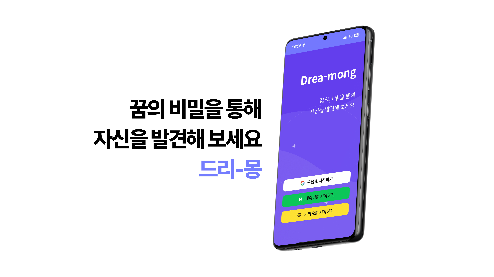
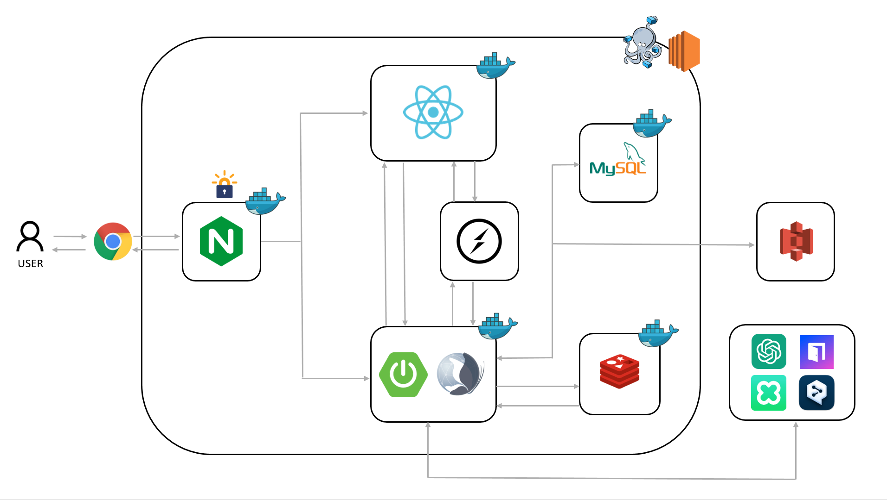
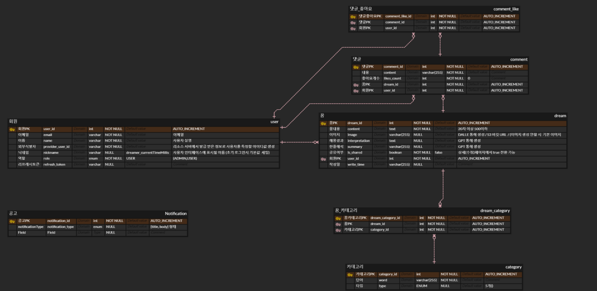

# README.md

# 🌜 Dreamong - 꿈을 기록하고 싶은 사람들을 위한 서비스



## Dreamong 링크 : https://i11c106.p.ssafy.io/

---

## 1️⃣ 프로젝트 개요

🌕 **개발 기간**
2023.07.02 ~ 2023.08.16 (7주)

🌕 **팀원 소개**

| 팀원   | 역할       | 상세                        |
| ------ | ---------- | --------------------------- |
| 서규범 | 팀장, FE   | 소셜 로그인, Socket.IO |
| 황민채 | FE, UI/UX, 기획 | 메인페이지, 꿈등록/상세페이지 |
| 김민주 | FE, UI/UX, 기획 | 꿈 광장, 통계 페이지  |
| 이학현 | BE, API    | 내/외부 API 설계, 문서 관리  |
| 남혁준 | BE, Infra | Security, Netty-Socket.IO |
| 김송은 | BE, QA     | 트러블 슈팅, 문서 관리 |

🌕 **기획 의도**

“드리-몽”은 사용자들이 경험하는 꿈이라는 독특하고 신비로운 영역을 다룹니다

이 서비스는 꿈의 의미를 해석하는 것 뿐만 아니라, 생성된 이미지를 통해 시각적으로 꿈을 표현하고, 사용자들이 서로 꿈을 공유하며 소통할 수 있는 플랫폼을 제공합니다. 꿈에 담긴 개인적인 의미와 상징을 다른 사람들과 나누며 공감대를 형성하고, 새로운 관점에서 꿈을 바라볼 수 있는 기회를 제공합니다.

궁극적으로, 이 프로젝트는 사용자들이 자신의 꿈을 기록하고, 그 꿈을 바탕으로 서로 소통함으로써 사용자 간의 교류와 이해를 증진하는 것을 목표로 하고 있습니다. 꿈의 기록과 공유를 통해 개인의 경험을 더욱 풍부하게 만들고, 서로의 꿈을 통해 새로운 시각을 나누는 장을 마련하고자 합니다.

🌕 **목표**
- 사용자 중심 경험 제공
  - 직관적이고 사용하기 쉬운 인터페이스 설계
  - 개인화된 AI 꿈 해석 서비스 제공
  - PWA 기술을 활용한 크로스 플랫폼 접근성 향상
- 생성형 AI 기술 활용
  - 최신 자연어 처리 기술을 활용한 정확하고 맥락에 맞는 꿈 해석
  - 텍스트뿐만 아니라 이미지 생성 AI를 활용
- 커뮤니티 형성 및 참여 촉진
  - 실시간 스트리밍 채팅방을 통한 사용자 간 소통 강화
  - 꿈 경험 공유 및 토론 기회 제공

---

## 2️⃣ 서비스 소개

## 1. 로그인

| 로그인 화면| 로그인 화면 | 로그인 화면  |  |
| --- | --- | --- | --- |
|  |  |   |  |
| - [로그인 화면] : 구글, 네이버, 카카오 소셜 로그인을 통해 로그인을 할 수 있다. | - [로그인 클릭 시] : SMS 인증을 통해 로그인을 할 수 있다. | - [로그인 완료 시] : 사용자 환영 메시지가 표시되며, 메인 메뉴로 이동할 수 있다. |  |


---

## 2. 메인 화면

| 메인 화면 | 메인 화면 | 메인 화면 | 메인 화면 |
| --- | --- | --- | --- |
|  |  |  |  |
| - [메인 화면] : 사용자가 등록한 꿈 내용을 날짜 별로 볼 수 있다. | - [메인 화면에서 꿈 클릭 시] : 해당 꿈에 대한 저장 내용을 보여준다. | - [삭제 버튼 클릭 시] : 삭제 여부에 대해 물어본다. | - [저장 버튼 클릭 시] : 사용자가 변경하고 싶은 내용을 변경 뒤 저장을 누르면 변경된 정보가 저장이 됩니다. |

---

## 3. 꿈 등록 페이지

| 꿈 등록 페이지 | 꿈 등록 페이지 | 꿈 등록 페이지 | 꿈 등록 페이지 |
| --- | --- | --- | --- |
|  |  |  |  |
| - [꿈 등록 페이지 클릭시] : 꿈 등록 페이지를 볼 수 있어요. | - [꿈 등록 페이지 클릭시] : 꿈 등록 페이지를 볼 수 있어요. | - [꿈 해몽 생성 버튼 클릭 시] : 꿈 내용을 기반으로 springAI를 통해 꿈 해몽을 제공한다. | - [꿈 이미지 생성 버튼 클릭 시] : 꿈 내용을 deepl api를 통해 영어로 번역하고 Novita.ai의 text to img with lcm api를 통해 꿈 이미지 제공한다. |

| 꿈 등록 페이지 | 꿈 등록 페이지 | 꿈 등록 페이지 | 꿈 등록 페이지 |
| --- | --- | --- | --- |
|  |  |  | .png) |
| - [꿈 이미지 생성 버튼 클릭 시] : 꿈 내용을 deepl api를 통해 영어로 번역하고 Novita.ai의 text to img with lcm api를 통해 꿈 이미지 제공한다. | - [꿈 이미지 생성 버튼 클릭 시] : 꿈 내용을 deepl api를 통해 영어로 번역하고 Novita.ai의 text to img with lcm api를 통해 꿈 이미지 제공한다. | - [꿈 이미지 생성 후] : 생성된 이미지를 Clova GreenEye api를 통해 검열한다. | - [꿈 공유 하기 버튼 클릭 시] : 다른 사람과 사용자의 꿈 내용을 공유할 수 있습니다. |

| 꿈 등록 페이지 | 꿈 등록 페이지 |  |  |
| --- | --- | --- | --- |
|  |  |  |  |
| - [꿈 저장 버튼을 누르면] : 저장을 누르면 openAI 를 통해 카테고리와 한 줄 요약을 뽑아 저장한다. | - [꿈 임시 저장 버튼을 누르면] : 임시 저장을 누르면 입력한 내용만 저장 합니다. |  |  |
---

## 4. 꿈 광장 페이지

| 꿈 광장 페이지 | 꿈 광장 페이지 | 꿈 광장 페이지 | 꿈 광장 페이지 |
| --- | --- | --- | --- |
|  |  |  |  
| - [꿈 광장 페이지 클릭 시] : 사람들이 공유한 꿈 들을 볼 수 있다. | - [꿈 광장에서 꿈 클릭] : 공유한 꿈 내용을 볼 수 있다. | - [꿈 광장에서 꿈 클릭] : 공유한 꿈 내용을 볼 수 있다.  | - [댓글 입력] : 댓글 입력 가능 |

| 꿈 광장 페이지 | 꿈 광장 페이지 |  |  |
| --- | --- | --- | --- |
|  |  |  |  |
| - [댓글 창 클릭 시] : 다른 사용자가 작성한 댓글을 보고 좋아요를 누를 수 있다. | - [댓글 삭제 버튼 클릭 시] : 자신이 등록한 댓글을 삭제할 수 있다. |  |  |

---

## 5. 통계 페이지

| 통계 페이지 | 통계 페이지  |  | |
| --- | --- | --- | --- |
|  |  |  |  |
| - [통계 페이지 클릭 시] : 사용자가 기록한 꿈 내용을 기반으로 생성된 한달간의 카테고리 데이터를 확인 할 수 있다. | [통계 페이지 클릭 시] : 사용자가 기록한 꿈 내용을 기반으로 생성된 한달간의 카테고리 데이터를 확인 할 수 있다. |  |  |

---

## 6. 스트리밍 페이지

| 스트리밍 페이지 | 스트리밍 페이지 | 스트리밍 페이지 | 스트리밍 페이지 |
| --- | --- | --- | --- |
|  |  |  |  |
| - [스트리밍 페이지 클릭 시] : 관리자가 등록한 스트리밍 방 목록을 볼 수 있습니다. | - [스트리밍 방 클릭 시] : 유튜브 링크를 통해 실시간 라이브 스트리밍 들을 수 있습니다. | - [채팅방을 통한 소통] : 채팅방을 통해 사람들과 소통을 할 수 있다.  | - [취침 시간 설정] : 취침 시간을 설정 할 수 있다. |

---

## 7. 설정 페이지

| 설정 페이지 | 설정 페이지 | 설정 페이지 |  |
| --- | --- | --- | --- |
|  |  |  |  |
| - [설정페이지 클릭 시] : 설정을 볼 수 있다. | - [로그아웃 클릭 시] : 로그아웃을 할 수 있다. | - [닉네임 변경 클릭시] : 사용자가 원하는 닉네임으로 변경 가능합니다.  |  |

---

## 3️⃣ 기술 스택

## 🌝 사용된 도구

- React 18.3.1
- Spring Boot 3.3.2
- Gradle 8.8
- IDE: Visual Studio Code 1.48, IntelliJ IDEA 2024.1.1 (Ultimate Edition)
- GitLab
- Jira
- Discord

## 🌝 사용된 기술

## 🌞[FE]


## 🌚[BE]


## 🌝[Infra]
 
 


## 🌝[기술]


**[ BACK END ]**

- **Spring Security** : SecurityFilterChain을 통해 필터를 적용하고 사용자 권한에 따라 인가 기능을 수행하도록 구현.
- **OAuth** : 외부 인증 서비스를 사용하여 사용자 인증을 간소화하고 보안을 강화.
- **JWT** : JSON Web Token을 활용하여 안전하고 신뢰성 있는 회원 인증 및 정보 교환을 구현.
- **MySQL** : 회원, 꿈, 통계, 스트리밍 방 등 핵심 데이터를 저장하는 데 사용.
- **Redis** : 인메모리 데이터 저장소로, 실시간 채팅 방의 이전 채팅 내역을 캐싱하고, 오래된 메시지를 삭제하여 효율적인 채팅 기록 관리 및 성능 최적화를 제공.
- **Netty-Socket.IO** : Netty 기반의 Socket.IO 서버를 통해 비동기 이벤트 처리와 고성능 실시간 스트리밍 방 별 그룹 채팅 기능을 구현.
- **OkHttp** : 효율적인 HTTP 클라이언트 라이브러리로, HTTP 기반의 요청/응답을 처리하고 실시간 서버 연결을 지원.
- **AWS**
  - **EC2** : Ubuntu 서버를 구축하고 호스팅에 사용.
  - **S3** : 꿈 이미지를 저장하기 위해 S3 서비스를 활용.
- **Nginx** : 고성능의 웹 서버로 활용하여 정적 파일 서빙 및 리버스 프록시 기능을 구현.
- **SSL 프로토콜** : SSL을 적용하여 전송되는 패킷 값을 암호화하여 외부의 공격자로부터 데이터를 보안하기 위해 사용.
  - **Let’s Encrypt** 무료 인증서를 발급받아 웹서버에 SSL 인증서를 적용.
  - PWA 활용 시, SSL 적용 필수.
- **Docker & Docker Compose** : 애플리케이션을 컨테이너화하여 이식성을 높였으며, Docker Compose를 사용하여 다중 컨테이너 애플리케이션 관리.
- **Novita.ai** : 꿈 내용 기반 이미지 생성을 위해 사용.
- **OpenAI** : 꿈 내용 기반 꿈 해몽 및 통계 분류를 위해 사용.
- **Clova** : 꿈 이미지 선정성 검열을 위해 사용.
- **DeepL** : 꿈 내용 번역을 위해 사용.

**[ FRONT END ]**

- **React** : 사용자 인터페이스를 구축하기 위한 컴포넌트 기반 JavaScript 라이브러리
- **Vite** : HMR(Hot Module Replacement)를 사용하여 애플리케이션을 다시 시작하지 않고도 일부 컨텐츠를 갱신함
- **tailwind** : 유틸리티 우선 CSS 프레임워크
- **SweetAlert2** : 다양한 기능과 디자인을 가진 Alert창을 구현.
- **chart.js** : 데이터 시각화를 위한 자유의 오픈 소스 자바스크립트 라이브러리
- **Swipe** : 월 선택을 위한 Carousel 구현
- **PWA**
    - 매니페스트를 활용하여 모바일에 어플 형태로 설치를 지원
- **Socket.IO**
    - 라이브러리 형태인 socket.io-client의 트래픽 격리 종류 중 Room 그룹을 활용하여 특정 클라이언트 그룹에 메시지를 보내도록 함


**[ TEAM Cooperation ]**

- **GitLab** : GitLab을 활용하여 프로젝트를 관리.
  - Git Flow 에 따른 브랜치 전략 수립.
  - MR 시 코드 리뷰 진행.
- **Jira** : 이슈 관리 도구로 활용.
  - 주요 기능들을 이슈로 등록하고 Story Point를 산정한 후, 담당자를 지정하여 프로젝트를 진행.
  - 1~2 주 정도 상황에 맞게 스프린트를 설정.
- **Discord** : 팀 내 커뮤니케이션 도구로 활용.
  - 프로젝트 진행 중 발생하는 이슈와 피드백을 실시간으로 공유.
  - 음성 채널을 통해 빠른 의사결정 및 회의를 진행.

## 🌝 시스템 아키텍쳐



## 🌝 ERD



---

## 🌝 폴더 구조

### 🌞[FE]

```
📦src
 ┣ 📂assets
 ┃ ┣ 📂logoSVG
 ┃ ┃ ┣ 📜btn_apple.svg
 ┃ ┃ ┣ 📜btn_gmail.svg
 ┃ ┃ ┣ 📜btn_google.svg
 ┃ ┃ ┣ 📜btn_kakao.svg
 ┃ ┃ ┗ 📜btn_naver.svg
 ┃ ┣ 📜404.png
 ┃ ┣ 📜500.png
 ┃ ┣ 📜back.svg
 ┃ ┣ 📜background.svg
 ┃ ┣ 📜censoredImg.png
 ┃ ┣ 📜detailBG.jpg
 ┃ ┣ 📜icons.jsx
 ┃ ┣ 📜img_generator.png
 ┃ ┣ 📜login.svg
 ┃ ┣ 📜logout.svg
 ┃ ┣ 📜react.svg
 ┃ ┣ 📜send.svg
 ┃ ┗ 📜user.svg
 ┣ 📂components
 ┃ ┣ 📜Button.jsx
 ┃ ┗ 📜NavigationBar.jsx
 ┣ 📂pages
 ┃ ┣ 📂DreamPage
 ┃ ┃ ┣ 📂components
 ┃ ┃ ┃ ┣ 📜ContentBox.jsx
 ┃ ┃ ┃ ┣ 📜DatePicker.jsx
 ┃ ┃ ┃ ┣ 📜ImageGenerator.jsx
 ┃ ┃ ┃ ┣ 📜InterpretationBox.jsx
 ┃ ┃ ┃ ┣ 📜ShareSettings.jsx
 ┃ ┃ ┃ ┗ 📜UpperBar.jsx
 ┃ ┃ ┣ 📜DreamDetailPage.jsx
 ┃ ┃ ┗ 📜DreamRegisterPage.jsx
 ┃ ┣ 📂LoginPage
 ┃ ┃ ┣ 📂components
 ┃ ┃ ┃ ┣ 📜FadeInText.jsx
 ┃ ┃ ┃ ┗ 📜LoginSuccess.jsx
 ┃ ┃ ┗ 📜LoginPage.jsx
 ┃ ┣ 📂SkeletonPage
 ┃ ┃ ┣ 📂components
 ┃ ┃ ┃ ┗ 📜SkeletonBlock.jsx
 ┃ ┃ ┣ 📜SquareDetailSkeletonPage.jsx
 ┃ ┃ ┣ 📜SquareSkeletonPage.jsx
 ┃ ┃ ┗ 📜StatisticsSkeletonPage.jsx
 ┃ ┣ 📂StreamingPage
 ┃ ┃ ┣ 📂components
 ┃ ┃ ┃ ┣ 📂legacy
 ┃ ┃ ┃ ┃ ┣ 📜StreamingList_WebRTC.jsx
 ┃ ┃ ┃ ┃ ┗ 📜StreamingRoom_WebRTC.jsx
 ┃ ┃ ┃ ┣ 📜StreamingList.jsx
 ┃ ┃ ┃ ┗ 📜StreamingRoom.jsx
 ┃ ┃ ┗ 📜StreamingPage.jsx
 ┃ ┣ 📜ErrorPage.jsx
 ┃ ┣ 📜MainPage.jsx
 ┃ ┣ 📜SettingsPage.jsx
 ┃ ┣ 📜SquareDetailPage.jsx
 ┃ ┣ 📜SquarePage.jsx
 ┃ ┗ 📜StatisticsPage.jsx
 ┣ 📂recoil
 ┃ ┗ 📜atoms.js
 ┣ 📂utils
 ┃ ┣ 📜api.js
 ┃ ┣ 📜firebase.js
 ┃ ┗ 📜utils.js
 ┣ 📜App.jsx
 ┣ 📜index.css
 ┗ 📜main.jsx
```

### 🌚[BE]

```
📦domain
 ┣ 📂api
 ┃ ┣ 📂controller
 ┃ ┃ ┗ 📜ImageController.java
 ┃ ┣ 📂dto
 ┃ ┃ ┣ 📜Translation.java
 ┃ ┃ ┣ 📜TranslationRequest.java
 ┃ ┃ ┗ 📜TranslationResponse.java
 ┃ ┗ 📂service
 ┃ ┃ ┣ 📜ImageService.java
 ┃ ┃ ┗ 📜NovitaAiService.java
 ┣ 📂aws
 ┃ ┣ 📜FileController.java
 ┃ ┗ 📜S3UploadService.java
 ┣ 📂config
 ┃ ┣ 📜AuditConfig.java
 ┃ ┣ 📜BeanConfig.java
 ┃ ┣ 📜CorsMvcConfig.java
 ┃ ┣ 📜DeepLConfig.java
 ┃ ┣ 📜FilterConfig.java
 ┃ ┣ 📜FirebaseConfig.java
 ┃ ┣ 📜S3Config.java
 ┃ ┣ 📜SchedulingConfig.java
 ┃ ┣ 📜SecurityConfig.java
 ┃ ┗ 📜SwaggerConfig.java
 ┣ 📂entity
 ┃ ┣ 📂category
 ┃ ┃ ┣ 📂controller
 ┃ ┃ ┃ ┗ 📜CategoryController.java
 ┃ ┃ ┣ 📂dto
 ┃ ┃ ┃ ┣ 📜CategoryResponseDto.java
 ┃ ┃ ┃ ┣ 📜CommonResponseDto.java
 ┃ ┃ ┃ ┣ 📜DreamTypeCountDto.java
 ┃ ┃ ┃ ┗ 📜ObjectResponseDto.java
 ┃ ┃ ┣ 📂repository
 ┃ ┃ ┃ ┗ 📜CategoryRepository.java
 ┃ ┃ ┣ 📂service
 ┃ ┃ ┃ ┗ 📜CategoryService.java
 ┃ ┃ ┣ 📜Category.java
 ┃ ┃ ┗ 📜Type.java
 ┃ ┣ 📂comment
 ┃ ┃ ┣ 📂controller
 ┃ ┃ ┃ ┗ 📜CommentController.java
 ┃ ┃ ┣ 📂dto
 ┃ ┃ ┃ ┣ 📜CommentRequest.java
 ┃ ┃ ┃ ┣ 📜CommentResponse.java
 ┃ ┃ ┃ ┗ 📜CommentUpdateLikesDto.java
 ┃ ┃ ┣ 📂repository
 ┃ ┃ ┃ ┗ 📜CommentRepository.java
 ┃ ┃ ┣ 📂service
 ┃ ┃ ┃ ┗ 📜CommentService.java
 ┃ ┃ ┗ 📜Comment.java
 ┃ ┣ 📂commentlike
 ┃ ┃ ┣ 📂repository
 ┃ ┃ ┃ ┗ 📜CommentLikeRepository.java
 ┃ ┃ ┗ 📜CommentLike.java
 ┃ ┣ 📂common
 ┃ ┃ ┣ 📜ApiResponse.java
 ┃ ┃ ┗ 📜BaseTimeEntity.java
 ┃ ┣ 📂dream
 ┃ ┃ ┣ 📂controller
 ┃ ┃ ┃ ┣ 📜DreamController.java
 ┃ ┃ ┃ ┗ 📜SquareController.java
 ┃ ┃ ┣ 📂dto
 ┃ ┃ ┃ ┣ 📜DreamCategoryDto.java
 ┃ ┃ ┃ ┣ 📜DreamCreateRequest.java
 ┃ ┃ ┃ ┣ 📜DreamDto.java
 ┃ ┃ ┃ ┣ 📜DreamGetResponse.java
 ┃ ┃ ┃ ┣ 📜DreamMainRequest.java
 ┃ ┃ ┃ ┣ 📜DreamMainResponse.java
 ┃ ┃ ┃ ┣ 📜DreamMainResponseWithCount.java
 ┃ ┃ ┃ ┣ 📜DreamUpdateLikesDto.java
 ┃ ┃ ┃ ┣ 📜DreamUpdateRequest.java
 ┃ ┃ ┃ ┣ 📜SquareDetailResponse.java
 ┃ ┃ ┃ ┗ 📜SquareGetResponseDto.java
 ┃ ┃ ┣ 📂repository
 ┃ ┃ ┃ ┗ 📜DreamRepository.java
 ┃ ┃ ┣ 📂service
 ┃ ┃ ┃ ┣ 📜DreamService.java
 ┃ ┃ ┃ ┗ 📜SquareService.java
 ┃ ┃ ┗ 📜Dream.java
 ┃ ┣ 📂dreamcategory
 ┃ ┃ ┣ 📂repository
 ┃ ┃ ┃ ┗ 📜DreamCategoryRepository.java
 ┃ ┃ ┗ 📜DreamCategory.java
 ┃ ┣ 📂notification
 ┃ ┃ ┣ 📂controller
 ┃ ┃ ┃ ┗ 📜NotificationController.java
 ┃ ┃ ┣ 📂dto
 ┃ ┃ ┃ ┗ 📜NotificationRequest.java
 ┃ ┃ ┣ 📂repository
 ┃ ┃ ┃ ┗ 📜NotificationRepository.java
 ┃ ┃ ┣ 📂scheduler
 ┃ ┃ ┃ ┗ 📜NotificationScheduler.java
 ┃ ┃ ┣ 📜Notification.java
 ┃ ┃ ┗ 📜NotificationType.java
 ┃ ┣ 📂room
 ┃ ┃ ┣ 📂controller
 ┃ ┃ ┃ ┗ 📜RoomController.java
 ┃ ┃ ┣ 📂dto
 ┃ ┃ ┃ ┗ 📜RoomListResponse.java
 ┃ ┃ ┣ 📂repository
 ┃ ┃ ┃ ┗ 📜RoomRepository.java
 ┃ ┃ ┣ 📂service
 ┃ ┃ ┃ ┗ 📜RoomService.java
 ┃ ┃ ┗ 📜Room.java
 ┃ ┗ 📂user
 ┃ ┃ ┣ 📂controller
 ┃ ┃ ┃ ┣ 📜AuthController.java
 ┃ ┃ ┃ ┣ 📜MainController.java
 ┃ ┃ ┃ ┣ 📜MyController.java
 ┃ ┃ ┃ ┗ 📜UserController.java
 ┃ ┃ ┣ 📂dto
 ┃ ┃ ┃ ┣ 📜UpdateNicknameRequest.java
 ┃ ┃ ┃ ┣ 📜UserDto.java
 ┃ ┃ ┃ ┗ 📜UserInfoResponse.java
 ┃ ┃ ┣ 📂repository
 ┃ ┃ ┃ ┗ 📜UserRepository.java
 ┃ ┃ ┣ 📂service
 ┃ ┃ ┃ ┗ 📜UserService.java
 ┃ ┃ ┣ 📜Role.java
 ┃ ┃ ┗ 📜User.java
 ┣ 📂exception
 ┃ ┣ 📂global
 ┃ ┃ ┗ 📜ControllerExceptionAdvice.java
 ┃ ┣ 📜BadRequestException.java
 ┃ ┣ 📜ForbiddenException.java
 ┃ ┣ 📜InvalidCommentException.java
 ┃ ┣ 📜InvalidDreamException.java
 ┃ ┣ 📜InvalidUserException.java
 ┃ ┣ 📜NicknameAlreadyExistsException.java
 ┃ ┣ 📜NotFoundException.java
 ┃ ┣ 📜RoomNotFoundException.java
 ┃ ┣ 📜ServerErrorException.java
 ┃ ┣ 📜UnauthenticatedException.java
 ┃ ┗ 📜UserNotFoundException.java
 ┣ 📂fcm
 ┃ ┗ 📜FcmService.java
 ┣ 📂jwt
 ┃ ┣ 📜JWTFilter.java
 ┃ ┗ 📜JWTUtil.java
 ┣ 📂oauth
 ┃ ┣ 📂dto
 ┃ ┃ ┣ 📜CustomOAuth2User.java
 ┃ ┃ ┣ 📜GoogleResponse.java
 ┃ ┃ ┣ 📜KakaoResponse.java
 ┃ ┃ ┣ 📜NaverResponse.java
 ┃ ┃ ┗ 📜OAuth2Response.java
 ┃ ┣ 📂factory
 ┃ ┃ ┣ 📜GoogleResponseFactory.java
 ┃ ┃ ┣ 📜KakaoResponseFactory.java
 ┃ ┃ ┣ 📜NaverResponseFactory.java
 ┃ ┃ ┗ 📜OAuth2ResponseFactory.java
 ┃ ┣ 📂handler
 ┃ ┃ ┗ 📜CustomSuccessHandler.java
 ┃ ┗ 📂service
 ┃ ┃ ┗ 📜CustomOAuth2UserService.java
 ┗ 📂socket
 ┃ ┣ 📜ChatMessage.java
 ┃ ┣ 📜SocketIoConfig.java
 ┃ ┣ 📜SocketIOEventHandler.java
 ┃ ┗ 📜SocketIOServerRunner.java
```
